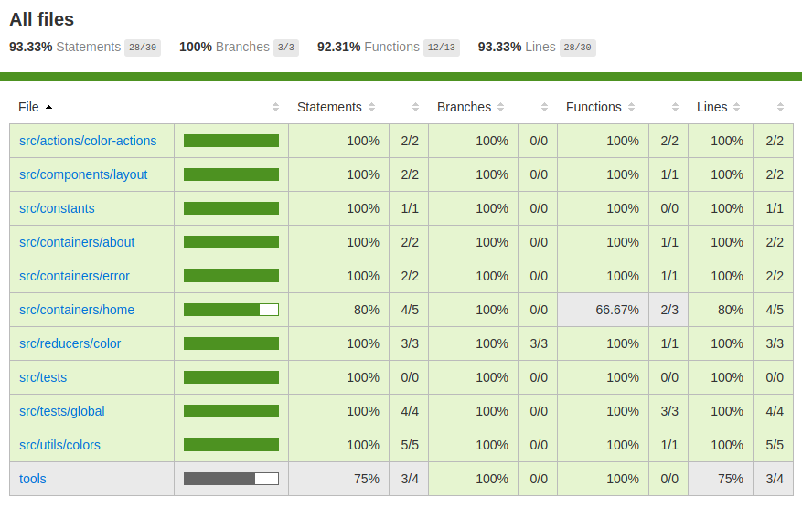

# Test coverage starter app
The table and picture below show you the test coverage of the example app




```
----------------------------|----------|----------|----------|----------|-------------------|
File                        |  % Stmts | % Branch |  % Funcs |  % Lines | Uncovered Line #s |
----------------------------|----------|----------|----------|----------|-------------------|
All files                   |    93.33 |      100 |    92.31 |    93.33 |                   |
 src/actions/color-actions  |      100 |      100 |      100 |      100 |                   |
  color-actions.jsx         |      100 |      100 |      100 |      100 |                   |
 src/components/layout      |      100 |      100 |      100 |      100 |                   |
  footer.jsx                |      100 |      100 |      100 |      100 |                   |
 src/constants              |      100 |      100 |      100 |      100 |                   |
  action-types.js           |      100 |      100 |      100 |      100 |                   |
 src/containers/about       |      100 |      100 |      100 |      100 |                   |
  about-container.jsx       |      100 |      100 |      100 |      100 |                   |
 src/containers/error       |      100 |      100 |      100 |      100 |                   |
  error-container.jsx       |      100 |      100 |      100 |      100 |                   |
 src/containers/home        |       80 |      100 |    66.67 |       80 |                   |
  home-container.jsx        |       80 |      100 |    66.67 |       80 |                18 |
 src/reducers/color         |      100 |      100 |      100 |      100 |                   |
  color-reducer.jsx         |      100 |      100 |      100 |      100 |                   |
  initialState.js           |      100 |      100 |      100 |      100 |                   |
 src/tests                  |      100 |      100 |      100 |      100 |                   |
  index.js                  |      100 |      100 |      100 |      100 |                   |
 src/tests/global           |      100 |      100 |      100 |      100 |                   |
  images-have-alt-tags.jsx  |      100 |      100 |      100 |      100 |                   |
 src/utils/colors           |      100 |      100 |      100 |      100 |                   |
  colors.js                 |      100 |      100 |      100 |      100 |                   |
 tools                      |       75 |      100 |      100 |       75 |                   |
  assetsTransformer.js      |    66.67 |      100 |      100 |    66.67 |                12 |
  enzymeTestAdapterSetup.js |      100 |      100 |      100 |      100 |                   |
----------------------------|----------|----------|----------|----------|-------------------|
```
